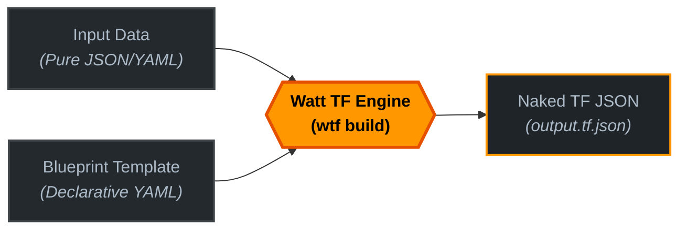

# Core concepts

To get the most out of **Watt TF**, it helps to understand the underlying architecture and the philosophy that drives it.

At its heart, Watt TF is a **declarative blueprint engine** designed to solve a single, painful problem: the mixing of raw business/application data with complex infrastructure logic in Terraform.


## 1. Separation of Concerns

In traditional Terraform setups, you often end up with complex configurations because your data structure doesn't match Terraform's flat resource architecture. You are forced to write `dynamic` blocks, nested `for_each` loops, and complex local variables in HCL.

**Watt TF completely decouples your data from your infrastructure templates:**



- **Input Data (The "What"):** Clean, nested, raw data (e.g., a list of microservices, database schemas, or routing tables) without any Terraform-specific code.
- **Blueprint (The "How"):** A declarative instruction set that describes *how* to map your input data onto Terraform resources.
- **Terraform JSON (The "Execution"):** Receives native, statically compiled JSON. No loops, no complex logic, just plain configuration.


## 2. Declarative Transformation (The Blueprint)

Unlike general-purpose template engines (like Jinja2 or Go Templates) which rely on text-based manipulation, Watt TF parses your inputs and blueprints into a structured AST (Abstract Syntax Tree) and evaluates them.

A blueprint consists of a list of `transform` blocks. Each block has a **target** and a **value**:

```yaml
transform:
- target: resource.local_file.${input.name}
  value:
    filename: ${input.name}
    content: ${input.content}
```

### Path Resolution

The target is a dot-notated path. Watt TF evaluates the variables inside the path and dynamically constructs the nested JSON object structure on the fly.

- It evaluates `${input.name}` and `${input.content}` from the input data.
- It resolves the path to `resource` -> `local_file` -> `microservice`.
- It places the evaluated `value` object exactly at that destination.

If parent objects (like `resource` or `local_file`) do not exist yet, Watt TF creates them automatically.


## 3. Variable Interpolation

Watt TF uses a lightweight syntax `${...}` to dynamically inject values. You can reference:

- `${input}`: Accesses the root of your input file (e.g., `${input.nested.property}`).
- `${env}`: Accesses environment variables of the running system (e.g., `${env.STAGE}`). Useful for injecting workspace or credential details on the fly.

Because the evaluation happens in Go memory, it is deterministic, lightning-fast, and happens before Terraform is ever invoked.


## 4. Advanced Logic with CEL (Common Expression Language)

While simple path resolution covers basic use cases, real-world infrastructure often requires logic—like filtering lists, setting defaults, or conditional evaluation.

Instead of inventing a proprietary shifting logic, **Watt TF embeds Google's Common Expression Language (CEL)**. CEL is a lightning-fast, safe, and highly predictable expression language used heavily throughout Kubernetes, Envoy, and Firebase.

You can supercharge your variable interpolation by writing inline CEL expressions inside your blueprints:

```yaml
transform:
- target: resource.aws_instance.${input.name}
  value:
    ami: ${input.ami}
    # Using a CEL ternary operator for fallback logic:
    instance_type: ${input.size == "large" ? "t3.large" : "t3.micro"}
    # Transforming data inline:
    tags:
      Environment: ${env.STAGE.upper()}
      ManagedBy: "Watt TF"
```

## 5. Conditional Transformations (`if` conditions)

Sometimes you don't just want to change a *value* dynamically, but decide whether an entire resource or block should be generated at all. In traditional Terraform, this requires confusing `count` or `for_each` hacks. 

In **Watt TF**, every transformation block can have an optional `if` statement powered by CEL. If the expression evaluates to `false`, the entire block is skipped during compilation.

```yaml
transform:
  # This resource is only created if production mode is enabled in the input
  - if: input.environment == "prod"
    target: resource.aws_instance.production_bastion
    value:
      ami: "ami-12345678"
      instance_type: "t3.medium"

  # Seamlessly inject cluster-specific settings
  - if: has(input.cluster_config) && input.cluster_config.enabled
    target: resource.kubernetes_cluster.main
    value:
      version: ${input.cluster_config.version}
```

## 6. Iterations (`for_each` loops)

Sometimes you want to perform actions multiple times, based on inputs. You can use the declarative `for_each` statement on any transformation block.

Watt TF iterates over the collection provided via CEL, exposes the current element as `item`, and its 0-indexed position as `item_index`.

```yaml
transform:
  - for_each: input.jobs
    target: "resource.job.${item.name}"
    value:
      name: "${item.name}"
      enabled: true
      # You can easily use math on the index via CEL
      id: "job-${item_index + 1}"
```

### Variables inside `for_each`

- `item`: The current element in the iteration.
- `item_index`: The 0-based index of the current element.